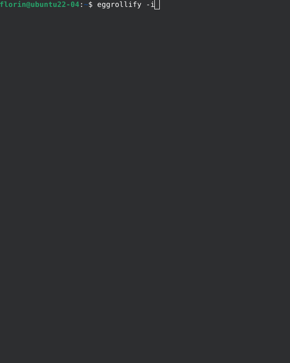

# Eggrollify
  

Script to download and install, list and remove Proton Glorious-Eggroll  builds

## Requirements

- [Python Requests](https://pypi.org/project/requests/)
- [Python psutil](https://pypi.org/project/psutil/)

## Install

### Ubuntu / Debian

- `wget https://github.com/florinDNL/eggrollify/releases/latest/download/eggrollify.deb`

- `sudo dpkg -i eggrollify.deb`

### Other Distros

- Make sure the python requests package is installed, e.g. on Arch: `pacman -S python-requests`
- Clone the repo or download the script file(s) locally
- (Optional) Add the bash script to the PATH for easier execution. Alternatively, you can run the python file directly

## Usage

`-i` will list all available versions found under the GitHub release page and will download/install whichever version is selected

`-r` will list all versions found locally in the steam folder and remove whichever is selected

`-li` will simply list all versions found locally

## Demo

